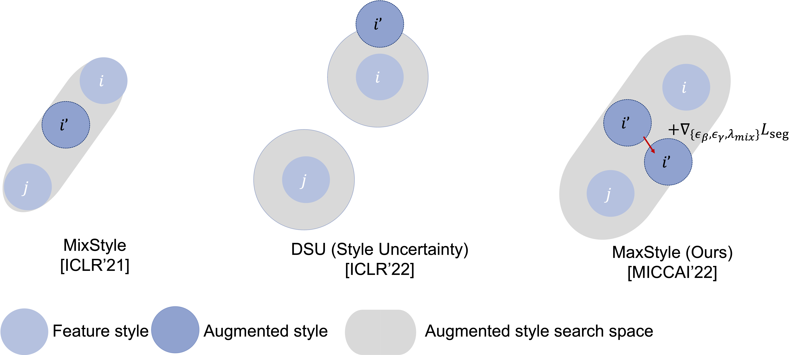
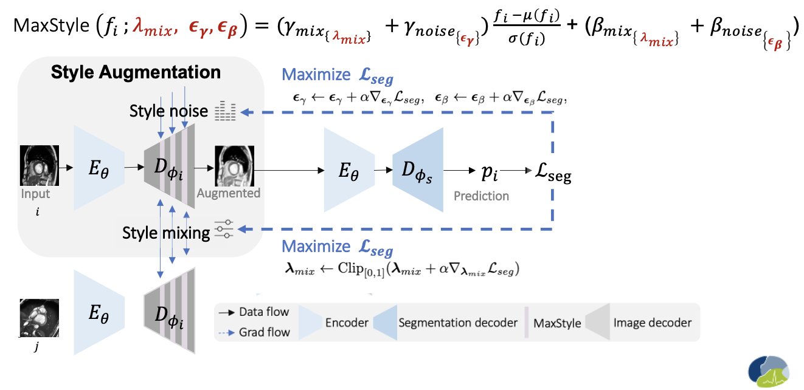

<p align="center">
  
  </a>
</p>

# MaxStyle
[MICCAI 2022] MaxStyle: Adversarial Style Composition for Robust Medical Image Segmentation

## Introduction:
MaxStyle is a novel feature-space data augmentation, which maximizes the effectiveness of style augmentation for enhancing model's out-of-domain (OOD) performance. MaxStyle augments data with improved image style diversity and hardness, by augmenting feature via style mixing and style perturbation and searching for the worst-case style composition via adversarial training. Below figure highlights the difference between ours style augmentation method and existing works for augmeting feature style $i$ to $i'$. MaxStyle expands the search space with increased style diversity and increase the hardness of style augmented images via style compositional parameters searching. These parameters are: style interpolation coefficient for style mixing $\lambda_{mix}\in [0,1]$, style noise related parameters for style perturbation $\epsilon_\gamma \in \mathrm{R}^C$, $\epsilon_\beta \in \mathrm{R}^C$. These learnable parameters are optimized in the direction of maximizing the segmentation loss $\mathcal{L}_{seg}$.  



Where to insert MaxStyle? Well, MaxStyle can be inserted after any conv blocks in a neural network, preferred to be applied to augmenting *low-level* features. In order to directly visualize the effect of MaxStyle and use it for standard image space data augmentation, in the paper, another major contribution is that we design an auxiliary style-augmented image decoder. This decoder is attached to the encoder of a segmentation network, turning the network to a dual-branch network for both image segmentation and image reconstruction/style augmentation. We found such a design can improve not only the interpretability of feture augmentation, but also the robustness of the segmentation network. We recommend to randomly insert MaxStyle in the low-level feature output from the decoder, e.g., insert MaxStyle after the last 1 st, 2nd, 3rd blocks.  

Below shows the formula of feature style augmentation for a given feature $f_i$ and the inner style optimization procedure with a dual-branch framework. 



After style optimization, the MaxStyle augmented image (generated by the decoder with optimized style compositional parameters) is then sent to optimize the segmentation network with a multi-task loss (segmentation loss and image reconstruction loss). 
Please check out our [Full paper](https://arxiv.org/abs/2206.01737) for more details.

Core implementation can be found at: 
- MaxStyle layer with learnable paprameters for smart style pertubation: [src/advanced/maxstyle.py](src/advanced/maxstyle.py).
- An example of an imasge decoder with MaxStyle layers inserted, see [MyDecoder.apply_max_style](https://github.com/cherise215/MaxStyle/blob/main/src/models/ebm/encoder_decoder.py#L598).
- Code for generating and optimizing style augmentation at training can be found at [src/models/advanced_triplet_recon_segmentation_model.py](https://github.com/cherise215/MaxStyle/blob/1bf62b2211b0b7828f53e24440985a8048ef717f/src/models/advanced_triplet_recon_segmentation_model.py#L458). 
- Main training and testing code: [src/train_adv_supervised_segmentation_triplet.py](src/train_adv_supervised_segmentation_triplet.py) 

## News:
- [x] MaxStyle training and testing code release [2022-8-23]
- [x] Baseline methods released [2022-9-1]

Incoming:
- [ ] Add jupyter notebook for ease of result analysis
- [ ] Add visualization of MaxStyle generated images

## Set Up
- Git clone this project
- (optional) Create a fresh Python 3.7.x virtual environment.
- Install PyTorch and other required python libraries with:
  `pip install -r requirements.txt`
- Install torchsample for data augmentation
  `pip install git+https://github.com/ozan-oktay/torchsample/`
## Data
### Cardiac multi-site, multi-sequence image segmentation dataset
In our paper, we trained our model on ACDC dataset and test it on a large-scale dataset, containing both corrupted and uncorrupted datasets from public benchmark datasets. However, due to limitations on redistribution put in place by the original data distributor, we cannot directly share data with you. But you can apply to download these cardiac data at:
- [ACDC2017](https://acdc.creatis.insa-lyon.fr/#challenge/5846c3366a3c7735e84b67ec)
- [M&M](https://www.ub.edu/mnms/)
- [MS-CMRSeg19](http://www.sdspeople.fudan.edu.cn/zhuangxiahai/0/mscmrseg19/data.html)

We are also happy to provide our preprocessed data with you, once you have been formally granted with all these permission to use these datasets.

### Prostate multi-site MRI segmentation
This large-scale multi-site prostate dataset contains prostate T2-weighted MRI data (with segmentation mask) collected from SEVEN different data sources out of FOUR public datasets, NCI-ISBI 2013 dataset [1], Initiative for Collaborative Computer Vision Benchmarking (I2CVB) dataset [2], Prostate MR Image Segmentation 2012 (PROMISE12) dataset [3], Medical Decathlon [4]. In our experiments, we use the last one for training and intra-domain testing, while the rest three (six sites) are used for testing. The training dataset can be downloaded from the [medical segmentation decathlon website](http://medicaldecathlon.com/). Test datasets can be originally downloaded from https://liuquande.github.io/SAML/. Training and test images have very different image appearance, even after performing histogram matching, see below.


We are also happy to share our preprocessed data here, which can be downloaded at [Google Drive](https://drive.google.com/file/d/1fMPqHETCvohh1e6D2rIlddWPLfHuyI8j/view?usp=sharing). Please note that this dataset is for research purpose ONLY.All images have been resampled to have uniform voxel spacings [0.625,0.625,3.6]. We remove black slices that do not contain prostate. All labels have been converted to binary masks (covering PZ+TZ) for binary segmentation, with 0 for background and 1 for foreground. 

Once downloaded, unzip it and put files under the `MaxStyle/data` dir, you can find that images and labels are re-oargnized as follows:
 - MaxStyle/data/MICCAI2022_multi_site_prostate_dataset/reorganized
    - A-ISBI
        - patient_1 
            - t2_img_clipped.nii.gz
            - label_clipped.nii.gz
        ...
    - B-ISBI_1.5
        - patient_1 
            - t2_img_clipped.nii.gz
            - label_clipped.nii.gz
        ...
    - C-I2CVB
    - D-UCL
    - E-BIDMC
    - F-HK
    - G-MedicalDecathlon

* Note that we fixed a bug in data preprocessing on OOD test data, the results may be slightly different from the reported values in our supplementary material. However, the conclusion is UNCHANGED. We found for prostate segmentation, compared to standard training, we can consistently improve IID performance and most importantly improve the performance on OOD test sets by ~25%, e.g., IID: 0.8474 vs 0.8704; OOD: 0.6339 vs 0.7938 (+25%). We encourage readers to rerun our method and baseline methods on their local machines for fair comparison.

# Project structure and core files
- `config`: folder contains configuration for training deep learning models
    - ACDC: folder contains configurations for training cardiac segmentation using ACDC training data
    - Prostate: folder contains configurations for training prostate segmentation using medical decathlon training data
- `data`: folder contains training/testing data 
- `src`: main code repository
    - `advanced`: contains implementation of advanced data augmentation
        - maxstyle.py: max style layer implementation
    - `dataset_loader`: contains code for loading different datasets
    - `models`: folder contains different basic neural nets and advanced neural networks 
        - advanced_triplet_recon_segmentation_model.py: dual-branch network implementation supports hard example training from latent space data augmentation
    - `train_adv_supervised_segmentation_triplet.py`: code for training and testing

## Training: Standard training with a dual-branch network
### Cardiac low-data regime segmentation (10 subjects)
- Standard training:
    ```
    cd path/to/MaxStyle
    cd /vol/biomedic3/cc215/Project/MaxStyle;
    source activate <your virtual env>;
    CUDA_VISIBLE_DEVICES=0 python src/train_adv_supervised_segmentation_triplet.py --json_config_path ./config/ACDC/1500_epoch/standard_training.json --cval 0 --seed 40 --data_setting 10 --auto_test --log
    ```
- MaxStyle training 
    ```
    CUDA_VISIBLE_DEVICES=0 python src/train_adv_supervised_segmentation_triplet.py --json_config_path ./config/ACDC/1500_epoch/MICCAI2022_MaxStyle.json --cval 0 --seed 40 --data_setting 10 --auto_test --log
    ```
We also provide our previous work as a baseline method: Latent space masking based data augmentation [MICCAI 2021](https://github.com/cherise215/Cooperative_Training_and_Latent_Space_Data_Augmentation)
```
   CUDA_VISIBLE_DEVICES=0 python src/train_adv_supervised_segmentation_triplet.py --json_config_path ./config/ACDC/1500_epoch/MICCAI2021_LSM.json --cval 0 --seed 40 --data_setting 10 --auto_test --log
``` 
### Cardiac high-data regime segmentation (70 subjects)
simply change `--data_setting 10` to `--data_setting 'standard'`.
- Standard training:
    ```
    cd path/to/MaxStyle
    cd /vol/biomedic3/cc215/Project/MaxStyle;
    source activate <your virtual env>;
    CUDA_VISIBLE_DEVICES=0 python src/train_adv_supervised_segmentation_triplet.py --json_config_path ./config/ACDC/1500_epoch/standard_training.json --cval 0 --seed 40 --data_setting 'standard' --auto_test --log
    ```
- MaxStyle training 
    ```
    CUDA_VISIBLE_DEVICES=0 python src/train_adv_supervised_segmentation_triplet.py --json_config_path ./config/ACDC/1500_epoch/MICCAI2022_MaxStyle.json --cval 0 --seed 40 --data_setting 'standard' --auto_test --log
    ```
### Prostate image segmentation
Before running, please make sure the root path in the configuration file (e.g. config/Prostate/standard_training.json) has been changed to your local path:
i.e., "root_dir": "path/to/prostate_multi_domain_data/reorganized/G-MedicalDecathlon",
- Standard training:
    ```
    cd path/to/MaxStyle
    cd /vol/biomedic3/cc215/Project/MaxStyle;
    source activate <your virtual env>;
    CUDA_VISIBLE_DEVICES=0 python src/train_adv_supervised_segmentation_triplet.py --json_config_path ./config/Prostate/standard_training.json --cval 0 --seed 40 --data_setting 'all' --auto_test --log
    ```
- MaxStyle training 
    ```
    CUDA_VISIBLE_DEVICES=0 python src/train_adv_supervised_segmentation_triplet.py --json_config_path ./config/Prostate/MICCAI2022_MaxStyle.json  --cval 0 --seed 40 --data_setting 'all' --auto_test --log
    ```
# Improved reproducibility with fixed seeds and training sets
Our code by default supports to train models with fixed random seed and a fixed selection of training set for controlled study. Of note, completely reproducible results are not guaranteed due to the nature of the PyTorch Design and GPU computation. One can change the `seed` and `cval` value in the above commands to train models with different set-ups for multiple runs and get an average score for model evaluation. In our experiments for cardiac low-data regime training, we ran training three times and reported average Dice scores of them. Specifically, we used three configurations:

A. --cval 0 --seed 40

B. --cval 1 --seed 20

C. --cval 2 --seed 10

## Visualization of loss curves and training progress:
```python
cd path/to/MaxStyle;
tensorboard --logdir ./saved --port 6066 --bind_all
```
Note: 6066 is a port number, which can be changed to other numbers. 

# Evaluation
By default, we run model evaluation automatically after training with `--auto_test` option turned on. Model parameters and results will all be saved under `saved/`. To re-run inference of a trained model without training, simply run the same training command with additional `--no_train` option on:
```python
CUDA_VISIBLE_DEVICES=<gpu id> python src/train_adv_supervised_segmentation_triplet.py --cval <cval id> --seed <seed number> --data_setting <data setting identifier> --json_config_path <path/to/json_config_file> --data_setting 10 --auto_test --no_train ;
```
e.g., to test the above trained model, one can simply run:

``` python
CUDA_VISIBLE_DEVICES=0 python src/train_adv_supervised_segmentation_triplet.py --cval 0 --seed 40 --json_config_path ./config/ACDC/1500_epoch/MICCAI2022_MaxStyle.json --log --data_setting 10 --no_train;
```
This will auto test the model saved with the highest validation accuracy during training. To test the model saved from the last epoch, simply turn on '--use_last_epoch'

```python
CUDA_VISIBLE_DEVICES=0 python src/train_adv_supervised_segmentation_triplet.py --cval 0 --seed 40 --json_config_path ./config/ACDC/1500_epoch/MICCAI2022_MaxStyle.json --log --data_setting 10 --no_train --use_last_epoch;
```

Once finished, reports will be auto generated under the folder `saved`.
- `saved`: contains saved checkpoints and test scores and log files (will appear after training).  They will be saved in a format like: 
    - model checkpoints: `saved/{experiment_name}/<dataset name>/<method>/<cval_id>/model/best/checkpoints/`.
    - report: `saved/{experiment_name}/<dataset name>/<method>/<cval_id>/model/best/checkpoints/report`.
   e.g.
        - `train_ACDC_10_n_cls_4/ACDC/1500_epoch/MICCAI2022_MaxStyle/0/model/best/checkpoints`: contains csv files reporting model performance. Here, the model was trained on ACDC dataset using 10 subjects for 1500 epochs and then evaludated on different testsets (only exists after testing). e.g. 
            - saved params: `image_decoder.pth`, `image_encoder.pth`, `segmentation_decoder.pth`
            - patient wise scores (Dice):`report/<dataset name>/<iter_1_detailed.csv>`
            - Average Dice scores for each dataset: `report/<dataset name>/<iter_1_summary.csv>`
            - Summary report contains scores for all test sets: `report/dataset_summary.csv`

# Run other baseline domain generalization methods:
By simply change the config file to other files, you can run other baseline methods for ease of comparison:

- A. RandConv: [RandConv: Robust and Generalizable Visual Representation Learning via Random Convolutions (ICLR2021)](https://openreview.net/forum?id=BVSM0x3EDK6)
    - e.g. 
        ```python 
        CUDA_VISIBLE_DEVICES=0 python src/train_adv_supervised_segmentation_triplet.py --json_config_path ./config/Prostate/RandConv.json --cval 0 --seed 40 --data_setting 'all' --auto_test --log
        ```
    - core implementation: [src/advanced/rand_conv_aug.py](src/advanced/rand_conv_aug.py)

- B. RSC: [Self-Challenging Improves Cross-Domain Generalization (ECCV2020)](https://arxiv.org/abs/2007.02454)
     - e.g. 
        ```python 
        CUDA_VISIBLE_DEVICES=0 python src/train_adv_supervised_segmentation_triplet.py --json_config_path ./config/Prostate/RSC.json --cval 0 --seed 40 --data_setting 'all' --auto_test --log
        ```
    - core implementation: [segmentation_solver.perturb_latent_code](src/models/advanced_triplet_recon_segmentation_model.py)


- C. MixStyle: [Domain Generalization with MixStyle (ICLR 2021)](https://openreview.net/forum?id=6xHJ37MVxxp)
     - e.g. 
        ```python 
        CUDA_VISIBLE_DEVICES=0 python src/train_adv_supervised_segmentation_triplet.py --json_config_path ./config/Prostate/MixStyle.json --cval 0 --seed 40 --data_setting 'all' --auto_test --log
        ```
    - core implementation: [src/advanced/mixstyle.py](src/advanced/mixstyle.py)]

- D. DSU: [Uncertainty Modeling for Out-of-Distribution Generalization](https://openreview.net/forum?id=6HN7LHyzGgC)
    - example:
        ```python 
        CUDA_VISIBLE_DEVICES=0 python src/train_adv_supervised_segmentation_triplet.py --json_config_path ./config/Prostate/DSU.json --cval 0 --seed 40 --data_setting 'all' --auto_test --log
        ```
    - core implementation: [src/advanced/mixstyle.py](src/advanced/mixstyle.py)] (set `mix`=`gaussian`)

- E. AdvNoise: [Virtual Adversarial Training: A Regularization Method for Supervised and Semi-Supervised Learning
(TPAMI 2017)](https://arxiv.org/abs/1704.03976)
    - example:
        ```python 
        CUDA_VISIBLE_DEVICES=0 python src/train_adv_supervised_segmentation_triplet.py --json_config_path ./config/Prostate/adv_noise.json --cval 0 --seed 40 --data_setting 'all' --auto_test --log
        ```
    - core implementation: [advchain/advchain/augmentor/adv_noise.py](advchain/advchain/augmentor/adv_noise.py)

- F. AdvBias: [Realistic Adversarial Data Augmentation for {MR} Image Segmentation, (MICCAI 2020)](https://arxiv.org/abs/1704.03976)
    - example:
        ```python 
        CUDA_VISIBLE_DEVICES=0 python src/train_adv_supervised_segmentation_triplet.py --json_config_path ./config/Prostate/adv_bias.json --cval 0 --seed 40 --data_setting 'all' --auto_test --log
        ```
    - core implementation: [advchain/advchain/augmentor/adv_bias.py](advchain/advchain/augmentor/adv_bias.py)

- G. LSM: [Cooperative Training and Latent Space Data Augmentation for Robust Medical Image Segmentation" (MICCAI 2021 Oral)](https://arxiv.org/abs/2107.01079)
    - example:
        ```python 
            CUDA_VISIBLE_DEVICES=0 python src/train_adv_supervised_segmentation_triplet.py --json_config_path ./config/Prostate/MICCAI2021_LSM.json --cval 0 --seed 40 --data_setting 'all' --auto_test --log
        ```
    - core implementation: [segmentation_solver.hard_example_generation](src/models/advanced_triplet_recon_segmentation_model.py)


# Citation
To cite MaxStyle in your publications, please use the following bibtex entry
```
@inproceedings{Chen2022MaxStyle,
  title="{MaxStyle}: Adversarial Style Composition for Robust Medical Image Segmentation",
  author        = "Chen, Chen and Li, Zeju and Ouyang, Cheng and Sinclair, Matthew  
                   and Bai, Wenjia and Rueckert, Daniel",
  booktitle     =  {MICCAI},
  year          =  {2022},
  eprint        = "2206.01737"
}
```


# Acknowledgements
We sincerely thank the organizers and collaborators of NCI-ISBI13 Challenge [1], I2CVB dataset [2] and PROMISE12 Challenge [3], Medical Decathlon [4]for sharing the data for public use. We thank Quande Liu (qdliu@cse.cuhk.edu.hk) for sharing the public multi-site prostate segmentation datasets[1-3]. Basic information of these datasets can be found at https://liuquande.github.io/SAML/. We also thank Kaiyang Zhou for his pioneering [MixStyle](https://github.com/KaiyangZhou/mixstyle-release) work. 

# Reference
- [1] Bloch, N., Madabhushi, A., Huisman, H., Freymann, J., et al.: NCI-ISBI 2013 Challenge: Automated Segmentation of Prostate Structures. (2015)

- [2] Lemaitre, G., Marti, R., Freixenet, J., Vilanova. J. C., et al.: Computer-Aided Detection and diagnosis for prostate cancer based on mono and multi-parametric MRI: A review. In: Computers in Biology and Medicine, vol. 60, pp. 8-31 (2015)

- [3] Litjens, G., Toth, R., Ven, W., Hoeks, C., et al.: Evaluation of prostate segmentation algorithms for mri: The promise12 challenge. In: Medical Image Analysis. , vol. 18, pp. 359-373 (2014).

- [4] Antonelli, Michela, Annika Reinke, Spyridon Bakas, Keyvan Farahani, Annette Kopp-Schneider, Bennett A. Landman, Geert Litjens, et al. 2022. “The Medical Segmentation Decathlon.” Nature Communications 13 (1): 1–13.